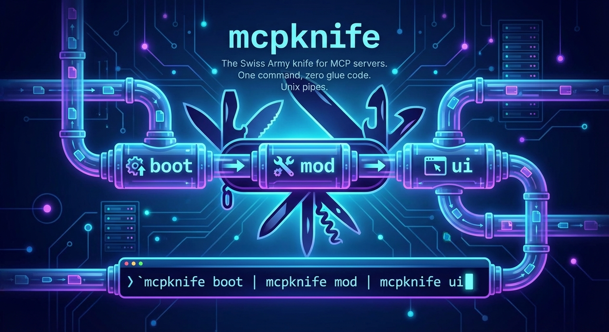

<p align="center">
  
</p>

# mcpknife

The Swiss Army knife for MCP servers. One command to generate, transform, and add UIs to MCP servers — with Unix pipes.

```bash
mcpknife boot --prompt "Hacker News API https://github.com/HackerNews/API" \
  | mcpknife mod --prompt "combine new + best into get_trending" \
  | mcpknife ui \
  | mcpknife export --output-dir ./my-server
```

That's it. Four stages, one pipeline, zero glue code. You go from API docs to a standalone MCP server with custom tool composition and auto-generated UI in a single command.

## What it does

mcpknife unifies three tools under one CLI, plus an export command:

| Command | What it does | Underlying tool |
|---------|-------------|-----------------|
| `mcpknife boot` | Generate an MCP server from a prompt + API docs | [mcpboot](https://npmjs.com/package/mcpboot) |
| `mcpknife mod` | Transform, rename, hide, or combine tools on an MCP server | [mcpblox](https://npmjs.com/package/mcpblox) |
| `mcpknife ui` | Auto-generate interactive UIs for MCP server tools | [mcp-gen-ui](https://npmjs.com/package/mcp-gen-ui) |
| `mcpknife export` | Dump the pipeline as a standalone MCP server project | built-in |

Each stage reads an upstream server URL from stdin and writes its own URL to stdout. Standard Unix pipes connect them. `export` is a terminal stage that crawls the pipeline via `_mcp_metadata` and generates a self-contained Node.js project.

## Install

```bash
npm install -g mcpknife
```

One install. Three tools. No extra setup.

## Usage

### Generate an MCP server from API docs

```bash
mcpknife boot --prompt "Yahoo Finance API https://finance.yahoo.com/api"
```

Point it at API documentation and describe what you want. mcpknife boots an MCP server with tools derived from the API.

### Transform tools on an existing server

```bash
mcpknife mod --upstream "npx some-mcp-server" --prompt "hide write tools, expose read-only"
```

Reshape any MCP server's tools using natural language. Rename, combine, filter, or create synthetic aggregation tools.

### Add UI to any MCP server

```bash
mcpknife ui --upstream-url http://localhost:3000/mcp
```

Auto-generates interactive UIs for every tool on the server.

### Export a standalone server

```bash
mcpknife boot --prompt "Free Dictionary API https://dictionaryapi.dev/" \
  | mcpknife mod --prompt "Create one tool: synonyms and antonyms" \
  | mcpknife ui \
  | mcpknife export --output-dir ./dict-server
```

Append `mcpknife export` to any pipeline to dump a self-contained Node.js project. The exported server runs independently — no mcpknife, mcpboot, mcpblox, or mcp-gen-ui required. Just `cd dict-server && npm install && node server.js`.

### Compose with pipes

The real power is composition. Each stage is a separate process connected by pipes:

```bash
# Generate → Transform → UI in one pipeline
mcpknife boot --prompt "GitHub API https://docs.github.com/en/rest" \
  | mcpknife mod --prompt "combine issues + pulls into get_activity" \
  | mcpknife ui

# Stack multiple transforms
mcpknife mod --upstream "npx some-server" --prompt "rename tools to snake_case" \
  | mcpknife mod --prompt "add synthetic summary tool" \
  | mcpknife ui --standard openai
```

## Configuration

Create `~/.mcpkniferc` to set defaults across all pipe stages:

```json
{
  "provider": "anthropic",
  "model": "claude-sonnet-4-20250514",
  "apiKey": "sk-ant-..."
}
```

No more repeating `--provider` and `--api-key` on every command. CLI flags still override config values when you need them to.

A project-level `./.mcpkniferc` overrides user-level settings, so teams can share provider/model defaults without sharing keys.

| Field | CLI flag | Description |
|-------|----------|-------------|
| `provider` | `--provider` | `anthropic` or `openai` |
| `model` | `--model` | LLM model ID |
| `apiKey` | `--api-key` | API key (or use env vars) |
| `verbose` | `--verbose` | Verbose logging |

**Precedence:** CLI flags > env vars > project `.mcpkniferc` > user `~/.mcpkniferc`

## How it works

mcpknife is a thin multiplexer. It doesn't implement MCP logic — it delegates entirely to the three underlying tools by spawning them as child processes with inherited stdio.

```
cli.ts → config.ts → resolve.ts → args.ts → spawn.ts → child process
```

This means:
- **Zero overhead.** `stdio: 'inherit'` — the OS kernel handles the plumbing, not mcpknife.
- **Zero coupling.** mcpknife only knows the CLI contract. Internal changes to the underlying tools don't affect it.
- **Pipe protocol works natively.** Each tool detects whether stdout is a pipe and adjusts its behavior (port selection, URL output) automatically.
- **Signals propagate cleanly.** Ctrl+C forwards to the child. Exit codes pass through.

## Subcommand reference

Run `mcpknife <command> --help` for full options:

```bash
mcpknife boot --help
mcpknife mod --help
mcpknife ui --help
mcpknife export --help
```

## Development

```bash
npm install
npm run build          # esbuild → dist/cli.js
npm test               # vitest
npm run dev            # tsx (no build needed)
```

## License

Apache-2.0
